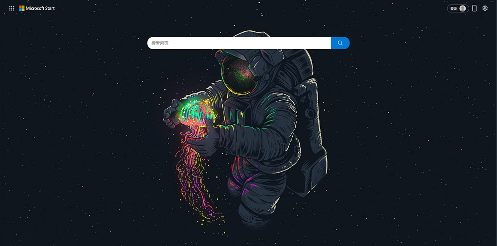

# 看一遍就懂的chrome扩展开发手册

图文并茂的描述和介绍，让你一遍就了解最基本的chrome扩展开发。

本手册是基于最新的扩展开发手册整理而来，扩展版本是v3。

官方文档参考地址: [https://developer.chrome.com/docs?hl=zh-cn](https://developer.chrome.com/docs?hl=zh-cn)

官方文档参考案例: [https://github.com/GoogleChrome/chrome-extensions-samples](https://github.com/GoogleChrome/chrome-extensions-samples)

为什么要写这个手册，因为在谷歌的计划中， **2024 年 6 月**开始为 Chrome 127 及更高版本**停用**[Chrome 稳定版本（开发者版、Canary 版和 Beta 版）中的 Manifest V2 扩展程序。

再加上，最近自己也想开发谷歌扩展，于是边学习边总结。

如有不足之处，欢迎指出讨论学习。

你可以直接在github上打开docs目录在线观看，或者安装VitePress，生成文档来阅读。

# 在线访问

访问在线网站:[Chrome扩展开发手册(https://chrome.lovefc.cn)](https://chrome.lovefc.cn)

此图为案例里制作的浏览器主题:

# 安装npm包

`npm install`

# 运行代码

`npm run docs:dev`

`npm run docs:build`

<mark>请注意,因为大小写的原因,在linux下会出现读取md文件失败的问题，我目前是在win下构建的生产环境。</mark>

# 文档维护

文档的维护与更新主要包括几个方面：

1. 修正错别字、语句不通等

2. 修正文档中的错误或不清晰的描述

3. 增加案例，纠正案例错误等

请在 GitHub,Gitee 上的源码仓库下 提交 ISSUE

