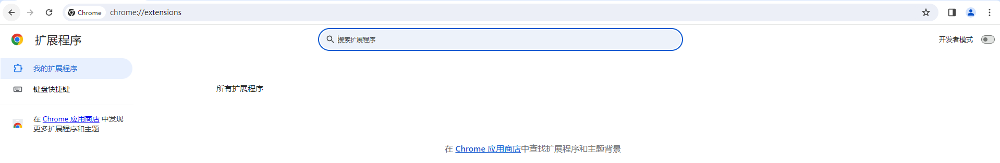

## 初步了解 

## chrome扩展是什么

如果我没有猜错，您在浏览这个页面的时候，一定是使用了浏览器！~~打钱~~

好的，现在您已经学会了如何使用浏览器，所以接下来，我向您介绍一下如何开发chrome扩展！

也许您现在就一直在使用chrome浏览器提供的扩展，比如翻译，截图等等这些实用小工具。

但您知道它是如何开发出来的吗？也许您打开edge，谷歌，360这些浏览器的扩展商店，能看到形形色色的应用，然后只要一键获取安装，就能够使用了，非常的方便。

还有些同学，甚至会利用油猴这些扩展脚本来扩展功能。

但它到底是什么？下面让我为您揭晓它的真实面目。

## chrome插件开发模式

首先我们下载一个扩展：[chrome案例1-扩展][hello]

是不是非常奇怪后缀是ctx，这是什么格式？

这就是chrome扩展的专用格式。

实际上，它就是一个zip压缩包。

做过安卓开发的同学是不是有点眼熟，因为apk其实也是zip压缩包。

你下载下来这个ctx安装包，然后把后缀改成zip，那么你就能解压看到目录了。~~是不是非常神奇？~~

# chrome插件开发模式

打开谷歌chrome浏览器，输入地址`chrome://extensions/`
> 你也可以使用其它使用chrome内核的浏览器，比如edge，360极速浏览器，qq浏览器等。

页面右上角有个开关，开启开发者模式，开启它。

# 运行第一个chrome开发插件 

开启开发者模式后，会出现一个按钮，名称为 `加载已解压的扩展程序`。
选择这个按钮，然后选择下载扩展之后解压的那个目录。

到此步，恭喜你，以开发者模式安装了第一个扩展程序。

点击这个扩展，你就能看到弹出的“你好”这两个字。

[hello]:https://github.com/lovefc/xxx.zip