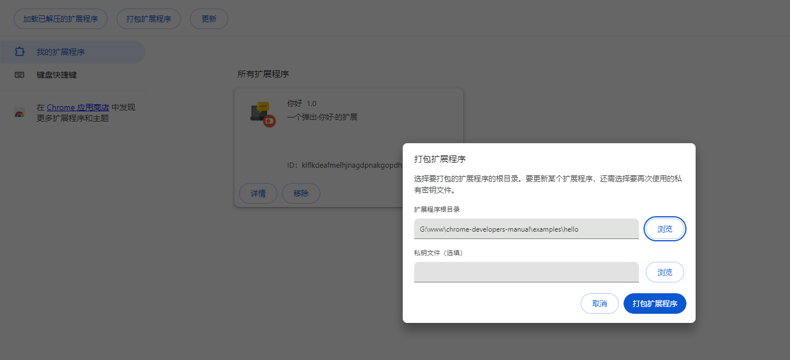

# 初步了解

# chrome扩展是什么

如果我没有猜错，您在浏览这个页面的时候，一定是使用了浏览器！~~打钱~~

好的，现在您已经学会了如何使用浏览器，所以接下来，我向您介绍一下如何开发chrome扩展！

也许您现在就一直在使用chrome浏览器提供的扩展，比如翻译，截图等等这些实用小工具。

但您知道它是如何开发出来的吗？也许您打开edge，谷歌，360这些浏览器的扩展商店，能看到形形色色的应用，然后只要一键获取安装，就能够使用了，非常的方便。

还有些同学，甚至会利用油猴这些扩展脚本来扩展功能。

但它到底是什么？下面让我为您揭晓它的真实面目。

# chrome插件开发模式

首先让我们clone这个项目，把项目下载到本地，不会git的同学可以直接下载zip包到本地解压。

打开谷歌chrome浏览器，输入地址`chrome://extensions/`

> 您也可以使用其它使用chrome内核的浏览器，比如edge，360极速浏览器，qq浏览器等。

页面右上角有个开关，开启开发者模式，开启它。

# 运行第一个chrome开发插件

开启开发者模式后，会出现一个按钮，名称为 `加载已解压的扩展程序`，选择这个按钮。
然后选择这个项目的`examples`目录下的`hello`。

到此步，恭喜您，以开发者模式安装了第一个扩展程序。

点击这个扩展，您就能看到弹出的“您好”这两个字。

# 打包第一个chrome开发插件

相信您也看到了`加载已解压的扩展程序`的旁边就是一个`打包扩展程度`的按钮。

chrome开发者模式也自带了打包功能，就是把扩展给打包成`xxx.ctx`

这就是chrome扩展的专用格式。

实际上，它本质就是一个zip压缩包，ctx可以改后缀成zip，然后用解压工具解压。

打包的时候，有一个选填的密匙，这个其实用来验证扩展程序身份。

如果您不填，也会在打包会生成一个`xxx.pem`文件，下次打包，您可以再次使用这个文件打包。

在 Linux 或 Mac上还可以使用命令行打包,使用 --pack-extension 参数指定扩展程序所在文件夹的位置，

使用 --pack-extension-key 指定扩展程序私有密钥文件的位置。

`chrome.exe --pack-extension=G:\hello --pack-extension-key=G:\hello.pem`

