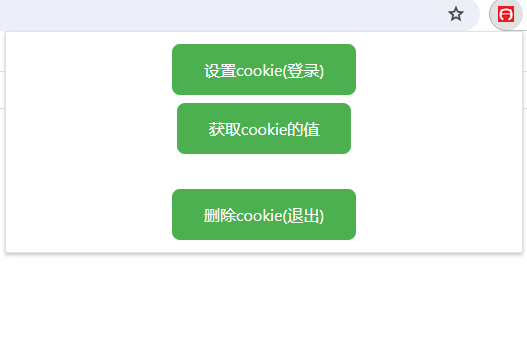

# Chrome API

扩展程序是绕不开api的，很多扩展程序都需要使用一个或多个 Chrome  API 才能正常运行。

Chrome API 是chrome自带的的接口（无需额外安装），部分API的使用需要在清单配置中添加权限才能正常使用。

打开官方手册：[API 参考  Chrome for Developers](https://developer.chrome.com/docs/extensions/reference/api?hl=zh-cn)

你能看到罗列的各种api方法，需要注意的是，<mark>部分api只有在chrome os上才能使用</mark>，浏览器扩展是不能使用的，官方手册上也标记了这一点。

而且需要注意的是，<mark>大多数api都是异步操作</mark>，一定要注意。

编写的扩展里面都使用到了api，查看js源码，你们就能看到。

这里我来举例一个操作cookie的扩展（源码：examples/操作Cookie）。



首先看清单配置：

```json
{
  // 配置文件版本,以后只支持3了
  "manifest_version": 3,
  // 扩展名称
  "name": "操作cookie",
  // 扩展介绍
  "description": "操作cookie的扩展",
  // 扩展版本
  "version": "1.0",
  // 扩展行为
  "action": {
    // 默认弹出
    "default_popup": "hello.html",      
    // 默认图标
    "default_icon": "images/icon.png"
  },
  "permissions": ["cookies"],
  // 匹配所有地址
  "host_permissions": ["<all_urls>"],
  // 图标
  "icons": {
    // 扩展程序页面和上下文菜单上的网站图标。
    "16": "images/icon.png",
    //     Windows 计算机通常需要此大小。
    "32": "images/icon.png",
    //    显示在“扩展程序”页面上。
    "48": "images/icon.png",
    // 安装时会显示在 Chrome 应用商店中。
    "128": "images/icon.png"
  }  
}
```

要操作cookies，必须要到清单里面加上权限，而且要加上主机权限地址匹配，这里我写的是所有网址。

打开popup.js，里面含有操作封装的函数

```js
......

// 设置cookie
async function set(cookie) {
  try {
    await chrome.cookies.set(cookie);
  } catch (error) {
    console.log(`Error: ${error.message}`);
    return;
  }
}

// 获取cookie
async function get(name, url) {
  try {
    const cookies = await chrome.cookies.get({ name: name, url: url });
    if (cookies.length === 0) {
      console.log('No cookies found');
      return;
    }
    return cookies;
  } catch (error) {
    console.log(`Error: ${error.message}`);
  }
  return;
}

// 删除cookie
async function remove(name, url) {
  try {
    let obj = { name: name, url: url };
    await chrome.cookies.remove(obj);
  } catch (error) {
    console.log(`error: ${error.message}`);
  }
}

......
```

关于函数的使用，一定要去参阅官方手册，那里写清楚了，什么参数，什么可选参数，都标记清楚了，不难理解。

大致上，所有的api都可以这样封装使用，用到扩展中。

因为js的基本语法，同步异步，我是默认看这个人都会的，这点不在手册的教学范围里面的，所以不多做说明。


