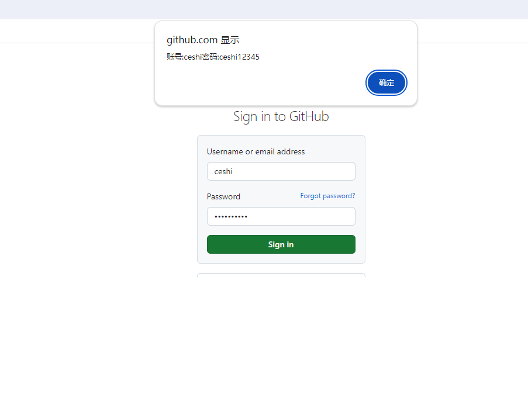

## 基本概念

首先，我们要搞明白一件事情，那就是chrome相当于一个类似于win，linux的操作系统，而扩展就是app。
业内人士总有一句话："浏览器就相当于半个操作系统"(可以这么说，但不建议你就这样认为)
谷歌出过一个笔记本，叫`Chromebook`，不了解的可以去搜索了解一下。
要写一个chrome扩展，就必须要有相应的权限，api调用，就跟安卓，ios开发中提供的系统底层调用一样，不过chrome扩展是比较简单的。
如果您用过微信小程序或者是其它小程序，就会发现chrome扩展其实跟那些小程序非常类似。

简单来说，就是你可以通过插件来控制浏览器的一系列的行为，比如获取网页cookies，改变网页，定义ua，代理等等。

通过扩展，可控制，可访问的信息是特别多的，所以在一些情况下，**请勿随便安装插件，有可能会窃取你的信息，历史记录，书签，甚至密码**。

而这，是可以轻易做到的，下面我将用一个案例来窃取你输入的密码。

这里我们就用github来举例，通过chrome插件来获取你在github登录页面输入的账号和密码。

此处案例在examples/获取输入

首先定义配置

```js
{
  // 配置文件版本,以后只支持3了
  "manifest_version": 3,
  // 扩展名称
  "name": "获取输入信息",
  // 扩展介绍
  "description": "获取输入信息,比如密码",
  // 扩展版本
  "version": "1.0",
  "action": {
    // 默认图标
    "default_icon": "images/icon.png"
  },  
  "content_scripts": [
    {
      "matches": ["https://github.com/login","https://github.com/session"],
      "js": ["content.js"]
    }
  ],  
  // 图标
  "icons": {
    // 扩展程序页面和上下文菜单上的网站图标。
    "16": "images/icon.png",
    //     Windows 计算机通常需要此大小。
    "32": "images/icon.png",
    //    显示在“扩展程序”页面上。
    "48": "images/icon.png",
    // 安装时会显示在 Chrome 应用商店中。
    "128": "images/icon.png"
  }
}
```

清单配置，基本上都有注释，这里出现的`content_scripts`（翻译过来就是内容脚本）就是来获取网页内容，甚至改变网页的核心配置。

`matches` 是一个数组，它定义了这个js该插到那个url网页里面，这里我写了github的登录网址。

如果是指定所有网页都插入，可以使用`"matches": ["https://*/*","http://*/*"]`。

当你启用插件之后，如果访问的是`https://github.com/login`，那么`content.js`就会被插入(注入)这个网页。

让我们看看`content.js`的内容：

```js
try {
   var form = document.forms[0];
   // 监听提交事件
   form.addEventListener("submit", myFunction);
} catch (error) {
   console.log(error);
}

function myFunction(event) {
    // 获取表单数据，这里的表单name需要自己去看实际网页的定义
    var name = event.target.elements["login"].value;
    var pass = event.target.elements["password"].value;
    // 打印账号密码
    alert(`账号:${name}密码:${pass}`);
}


```

可以看到，其实就是监听提交事件，然后定义一个函数，获取提交的账号名和密码。

运行结果如下图：




可以看到，我们已成功的获取到账号和密码，我这里只是用了打印显示出来，如果是一些恶意的插件，可能会直接把账号和密码<mark>上传到它的服务器</mark>。


现在你是不是对于chrome扩展有了一个新的认识？其实它还可以做到更多的事情。
