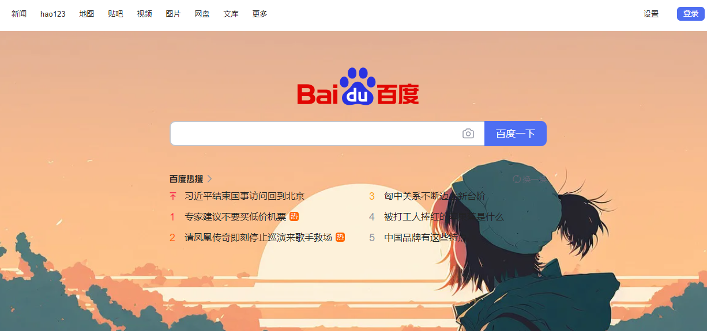

# 内容脚本

内容脚本也叫做"注入脚本",顾名思义，就是在网页中插入js，css，可以控制，读取和改变网页内容。

需要注意的是，内容脚本并没有访问全部chrome扩展api的权限，你可以使用的api只有以下几个：

* [`dom`](https://developer.chrome.com/docs/extensions/reference/api/dom?hl=zh-cn)
* [`i18n`](https://developer.chrome.com/docs/extensions/reference/api/i18n?hl=zh-cn)
* [`storage`](https://developer.chrome.com/docs/extensions/reference/api/storage?hl=zh-cn)
* [`runtime.connect()`](https://developer.chrome.com/docs/extensions/reference/api/runtime?hl=zh-cn#method-connect)
* [`runtime.getManifest()`](https://developer.chrome.com/docs/extensions/reference/api/runtime?hl=zh-cn#method-getManifest)
* [`runtime.getURL()`](https://developer.chrome.com/docs/extensions/reference/api/runtime?hl=zh-cn#method-getURL)
* [`runtime.id`](https://developer.chrome.com/docs/extensions/reference/api/runtime?hl=zh-cn#property-id)
* [`runtime.onConnect`](https://developer.chrome.com/docs/extensions/reference/api/runtime?hl=zh-cn#event-onConnect)
* [`runtime.onMessage`](https://developer.chrome.com/docs/extensions/reference/api/runtime?hl=zh-cn#event-onMessage)
* [`runtime.sendMessage()`](https://developer.chrome.com/docs/extensions/reference/api/runtime?hl=zh-cn#method-sendMessage)

虽然不能直接访问，但可以通过与扩展程序的其他部分[交换消息](https://developer.chrome.com/docs/extensions/develop/concepts/messaging?hl=zh-cn)来间接访问它们。


下面来看一个内容页的案例，浏览器扩展，加载`examples/改变背景`这个扩展。

然后访问百度或者谷歌首页，你会发现，背景改变了，变成了一张图片。

如果你查看图标的话，就会发现，网页脚本不触发的时候(没有访问这个网址)，图标会变灰。



打开manifest.json清单文件查看，就能看到内容脚本的定义

```
  // 特定页面注入的js,matches表示匹配的网址，只有网址匹配，才会注入该js
  "content_scripts": [
    {
      "matches": ["https://www.baidu.com/*","https://www.google.com/*"],
      "js": ["content.js"]
    }
  ]
```

content.js的代码，其实就是操作dom，给body加上一个背景图片

```
document.body.style.backgroundColor = "#000";
document.body.style.backgroundImage = 'url(https://cdn.pixabay.com/photo/2022/12/01/04/35/sunset-7628294_1280.jpg)';
document.body.style.backgroundSize = 'cover';
document.body.style.backgroundPosition = 'center';
document.body.style.backgroundRepeat = 'no-repeat';
```

这就是最简单的注入脚本，它就是在访问的网页中，插入了一个js，利用这个js，你就能操作当前的网页样式，内容。


