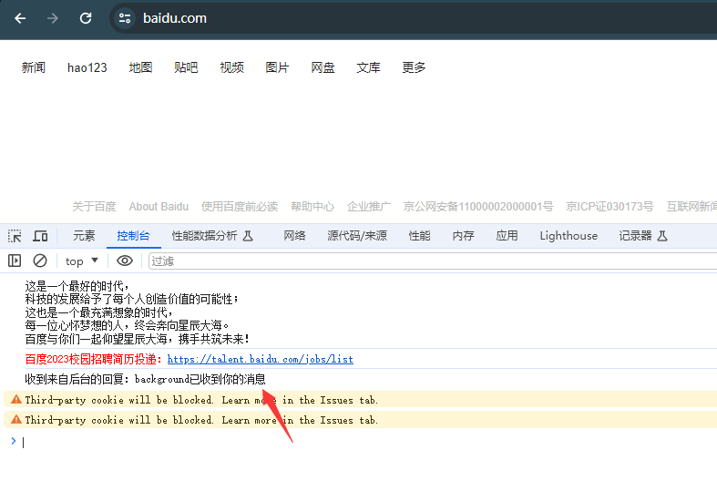
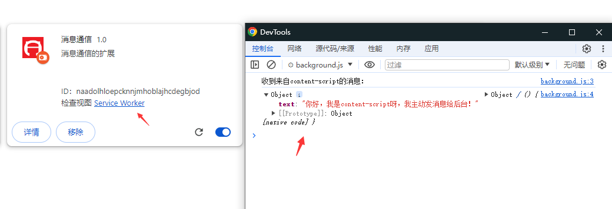

# 脚本消息通信


因为内容脚本作为插入网页的js，所以不具备访问api的一些权限，但如果我们要获取网页的内容，并且跟api交互，这时候该怎么做呢，这时候就需要消息通信了，我们可以利用chrome.runtime.sendMessage这个api，把内容脚本的信息传递到background(背景),popup(弹出页)进行处理。

首先在content.js中主动发消息：

```js
chrome.runtime.sendMessage({text: '你好，我是content-script呀，我主动发消息给后台！'}, function(response) {
    console.log('收到的回复：' + response);
});
```

background.js或者popup.js中都能接受这条消息，但是你要写代码监听消息：

```js
// 监听消息
chrome.runtime.onMessage.addListener(function(request, sender, sendResponse)
{
    console.log('收到来自content-script的消息：');
    console.log(request, sender, sendResponse);
    //做出回应
    sendResponse('popup已收到你的消息'); 
});
```

配置清单这样定义：

```json
  "action": {
    // 默认弹出
    "default_popup": "hello.html",      
    // 默认图标
    "default_icon": "images/icon.png"
  },
  "content_scripts": [
    {
      "matches": ["<all_urls>"],
      "js": ["content.js"]
    }
  ], 
  "background": {
    "service_worker": "background.js"
  },
```

这里只有访问百度，才会触发自动发信息给background或者popup。






conteng.js可以同时给popup.js或者background.js发送通信，但要注意的是

<mark>popup页面未打开的时候，不会收到回复，必须处于弹出页面的时候，才能进行通讯。</mark>

v2的时候，popup是可以直接引用background的函数的，但在v3版本里面已经不能这样做的。


popup，background，content 都是可以利用chrome.runtime.sendMessage监听和发送消息。

这里要注意的是：

popup给content发送消息，要获取到tab.id，根据tab.id发送消息到content。

```js
// 获取页面id，然后给指定的页面发送消息
function sendMessageToContentScript(message, callback) {
    // 获取到页面id
    chrome.tabs.query({ active: true, currentWindow: true }, function (tabs) {
        //console.log(tabs);
        // 发送消息
        chrome.tabs.sendMessage(tabs[0].id, message, function (response) {
            if (callback) callback(response);
        });
    });
}
```

配置清单里面，也要写上

```json
  // 权限
  "permissions": [
    "tabs",
  ]
```

这里的代码都集中到案例：`examples/消息通知`，请打开这个进行参考。


