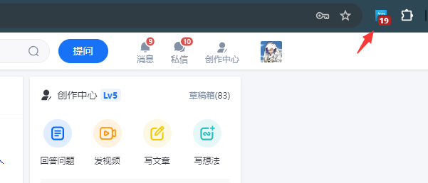

# 后台脚本

在配置清单中，background是是独立的，运行在后台的脚本。
它常常是这样定义的

```
  "background": {
     //该键会指定单个 JavaScript 文件
    "service_worker": "background.js"
  },
```

在新的v3清单配置里面，它其实不再被叫做后台脚本，而是叫<mark>Service Worker</mark>。


如果需要导入脚本，则可以这样定义（不支持导入断言）

```
  "background": {
    "service_worker": "service-worker.js",
    "type": "module"
  }
```

通常，Chrome 会在满足以下条件之一时终止 Service Worker：

* 无操作 30 秒后。收到事件或调用扩展程序 API 会重置此计时器。
* 单个请求（例如事件或 API 调用）的处理用时超过 5 分钟。
* 当 [`fetch()`](https://developer.mozilla.org/docs/Web/API/fetch) 响应的传递时间超过 30 秒时。

<mark>请注意，如果 Service Worker 关闭，您设置的任何全局变量都将丢失。</mark>

当用户从 Chrome 应用商店安装或更新 Service Worker，或者用户使用 `chrome://extensions` 页面[加载或更新已解压的扩展程序](https://developer.chrome.com/docs/extensions/get-started/tutorial/hello-world?hl=zh-cn#load-unpacked)时，就会发生安装事件。按以下顺序发生三个事件。

### ServiceWorkerRegistration.install

安装期间触发的第一个事件是 Web Service Worker 的 [install](https://developer.mozilla.org/docs/Web/API/ServiceWorkerGlobalScope/install_event) 事件。

### chrome.runtime.onInstalled

接下来是该扩展程序的 [`onInstalled`](https://developer.chrome.com/docs/extensions/reference/api/runtime?hl=zh-cn#event-onInstalled) 事件，当该扩展程序（而不是 Service Worker）首次安装时、该扩展程序更新到新版本以及 Chrome 更新到新版本时，都会触发该事件。使用此事件来设置状态或一次性初始化，例如[上下文菜单](https://developer.chrome.com/docs/extensions/reference/api/contextMenus?hl=zh-cn)。

```js
chrome.runtime.onInstalled.addListener((details) => {
  if(details.reason !== "install" && details.reason !== "update") return;
  chrome.contextMenus.create({
    "id": "sampleContextMenu",
    "title": "Sample Context Menu",
    "contexts": ["selection"]
  });
});
```

### ServiceWorkerRegistration.active

最后，系统将触发 Service Worker 的 [activate](https://developer.mozilla.org/docs/Web/API/ServiceWorkerGlobalScope/activate_event) 事件。请注意，与 Web Service Worker 不同，此事件会在安装扩展程序后立即触发，因为没有与扩展程序中的页面重新加载相媲美的功能。

## 事件

扩展 Service Worker 支持特定 API 中的事件，下面是一些常见的事件（有些需要搭配权限使用）

| api                                                                                                              | 作用                                                                                                                                                                                                                                                                                               |
| ---------------------------------------------------------------------------------------------------------------- | ------------------------------------------------------------------------------------------------------------------------------------------------------------------------------------------------------------------------------------------------------------------------------------------------ |
| [`chrome.action`](https://developer.chrome.com/docs/extensions/reference/api/action)                             | 响应用户与扩展程序工具栏图标的交互而触发，无论该操作是针对特定页面（选项卡）还是针对整个扩展程序。                                                                                                                                                                                                                                                |
| [`chrome.management`](https://developer.chrome.com/docs/extensions/reference/api/management)                     | 提供与安装、卸载、启用和禁用扩展相关的事件。                                                                                                                                                                                                                                                                           |
| [`chrome.notifications`](https://developer.chrome.com/docs/extensions/reference/api/notifications)               | 提供与用户与扩展生成的系统通知交互相关的事件。                                                                                                                                                                                                                                                                          |
| [`chrome.permissions`](https://developer.chrome.com/docs/extensions/reference/api/permissions)                   | 指示用户何时授予或撤销扩展权限。                                                                                                                                                                                                                                                                                 |
| [`chrome.runtime`](https://developer.chrome.com/docs/extensions/reference/api/runtime)                           | 提供与扩展程序生命周期相关的事件、从扩展程序其他部分发送的消息以及可用扩展程序或 Chrome 更新的通知。                                                                                                                                                                                                                                           |
| [`chrome.storage.onChanged`](https://developer.chrome.com/docs/extensions/reference/api/storage#event-onChanged) | [`StorageArea`](https://developer.chrome.com/docs/extensions/reference/api/storage#type-StorageArea)每当清除任何对象或更改或设置键的值时都会触发。请注意，每个`StorageArea`实例都有自己的[`onChanged`](https://developer.chrome.com/docs/extensions/reference/api/storage#type-StorageArea:%7E:text=PROPERTIES-,onChanged,-event)事件。 |
| [`chrome.webNavigation`](https://developer.chrome.com/docs/extensions/reference/api/webNavigation)               | 提供有关飞行中导航请求状态的信息。                                                                                                                                                                                                                                                                                |

## 实例演示

这里我们来搭配案例来实战一下，这里我们加载`examples/知乎消息`这个扩展。

这个扩展就是利用后台脚本每过6秒就读取一下消息数量，然后改变角标进行提醒，不用打开网页就能看到你的消息数量。



这个扩展，主要是不断的从后台访问知乎消息的api接口，获取到接口数据

这里面就要用到[fetch](https://developer.chrome.com/docs/extensions/develop/concepts/network-requests?hl=zh-cn) API来进行访问，在以前v2中一般是使用[`XMLHttpRequest`](https://www.w3.org/TR/XMLHttpRequest/) API

这两个api无需申请权限，可以在背景脚本里面直接使用，但是因为同源策略，我们需要请求跨源权限。

在清单配置要里面定义

```json
  // 背景js(运行在浏览器后台的脚本)
  "background": {
    "service_worker": "background.js"
  },
  // 背景js申明请求跨源权限
  "host_permissions": [
    "https://www.zhihu.com/*"
  ]
```

这里的网址可采取通配的方式来定义，不然访问会出现<mark>跨域错误</mark>。

js部分就是正常访问知乎消息的api

```js
// 获取知乎消息
async function getZhihuMsgCount() {
    let jsonData = { error: 'not' };
    try {
        const response = await fetch("https://www.zhihu.com/api/v4/me");
        jsonData = await response.json();
    } catch (error) {
        console.log(error);
        return;
    }
    if (jsonData.error) {
        console.log('未登录知乎');
        return;
    }
    // 读取所有的消息
    let messages_count = jsonData.messages_count;
    let default_notifications_count = jsonData.default_notifications_count;
    let vote_thank_notifications_count = jsonData.vote_thank_notifications_count;
    let follow_notifications_count = jsonData.follow_notifications_count;
    let number = messages_count + default_notifications_count + vote_thank_notifications_count + follow_notifications_count;

    // 设置图标和消息
    if (number && number != 0) {
        chrome.action.setIcon({ path: "images/zhihu.png" });
        setMsg(number.toPrecision());
    }
};
```
