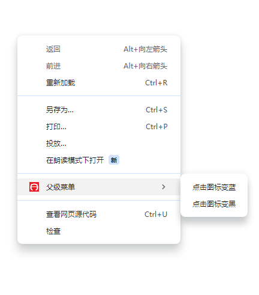

# 声明权限

就跟当前的app开发一样，权限是绕不开的话题，谷歌扩展需要在清单配置(manifest.json)中声明权限。

就比如定位，右键菜单，访问cookies，存储....等等，不仅需要api的配合，也需要申请权限。

下面是关于申请权限的类别和介绍：


| 命名                                                                                                                                       | 描述                                                                                                                                                                                                                                           |
| ---------------------------------------------------------------------------------------------------------------------------------------- | -------------------------------------------------------------------------------------------------------------------------------------------------------------------------------------------------------------------------------------------- |
| [`"permissions"`](https://developer.chrome.com/docs/extensions/reference/permissions-list?hl=zh-cn)                                      | 安装时的配置，包含[已知字符串](https://developer.chrome.com/docs/extensions/reference/permissions-list?hl=zh-cn)列表中的项。更改可能会触发[警告](https://developer.chrome.com/docs/extensions/develop/concepts/declare-permissions?hl=zh-cn#warnings)                     |
| [`"optional_permissions"`](https://developer.chrome.com/docs/extensions/reference/api/permissions?hl=zh-cn)                              | 由用户在运行时（而不是在安装时）授予                                                                                                                                                                                                                           |
| [`"content_scripts.matches"`](https://developer.chrome.com/docs/extensions/develop/concepts/content-scripts?hl=zh-cn#static-declarative) | 包含一个或多个[匹配模式](https://developer.chrome.com/docs/extensions/develop/concepts/match-patterns?hl=zh-cn)，允许内容脚本注入到一个或多个主机中。更改可能会触发[警告](https://developer.chrome.com/docs/extensions/develop/concepts/declare-permissions?hl=zh-cn#warnings)。     |
| [`"host_permissions"`](https://developer.chrome.com/docs/extensions/develop/concepts/declare-permissions?hl=zh-cn#host-permissions)      | 主机权限，包含一个或多个[匹配格式](https://developer.chrome.com/docs/extensions/develop/concepts/match-patterns?hl=zh-cn)，可授予对一个或多个主机的访问权限。更改可能会触发[警告](https://developer.chrome.com/docs/extensions/develop/concepts/declare-permissions?hl=zh-cn#warnings)。 |
| `"optional_host_permissions"`                                                                                                            | 由用户在运行时（而不是在安装时）授予                                                                                                                                                                                                                           |

ps:文中的链接可以直接定位到谷歌扩展开发平台，大陆需要特殊访问。

可以看到大致分为了2种，一种是安装是申请的权限，一种是运行时申请的权限。

<mark>有些权限会触发警告，用户必须允许才能继续使用扩展程序。</mark>

配置如下所示：

```json
{
  "name": "Permissions Extension",
  ...
  "permissions": [
    "activeTab",
    "contextMenus",
    "storage"
  ],
  "optional_permissions": [
    "topSites",
  ],
  "host_permissions": [
    "https://www.developer.chrome.com/*"
  ],
  "optional_host_permissions":[
    "https://*/*",
    "http://*/*"
  ],
  ...
  "manifest_version": 3
}
```

下面我们通过案例来进一步了解权限的使用。

在**浏览器上扩展程序**页面，**加载已解压的扩展程序**，选择本项目的`examples\右键菜单`。


加载完之后，随便在新页面鼠标右键，你就会看到一个新增加了一个菜单栏。



这个菜单栏，就是通过申请权限来操作的。打开`examples/右键菜单/manifest.json`文件，你将能看到“permissions”声明了一个数组，并且写了“contextMenus”。

```
  // 要在上下文菜单添加内容，必须要启用这个api权限
  "permissions": [
    "contextMenus"
  ],
  // 背景js(运行在浏览器所有页面的js)
  "background": {
    "service_worker": "popup.js"
  }
```

<mark>如果不给这个权限，那么你将无法操作菜单栏。</mark>

权限申请都是配合api的，光申请是没用的，我们还得配合api，来创建，更新，删除菜单。

这些api方法，这里写免得长篇大论了，可以直接去看谷歌扩展的文档描述。

contextMenus-api文档:[chrome.contextMenuss](https://developer.chrome.com/docs/extensions/reference/api/contextMenus)

我这里申请了背景js，打开`popup.js`你能看到里面的js操作逻辑，我也给了相应的注释。


