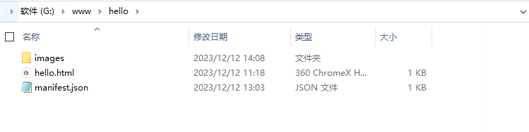
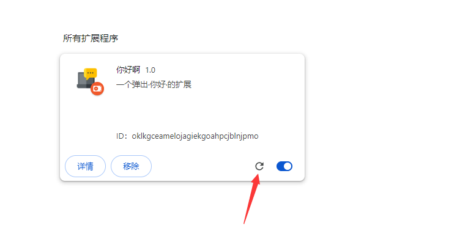
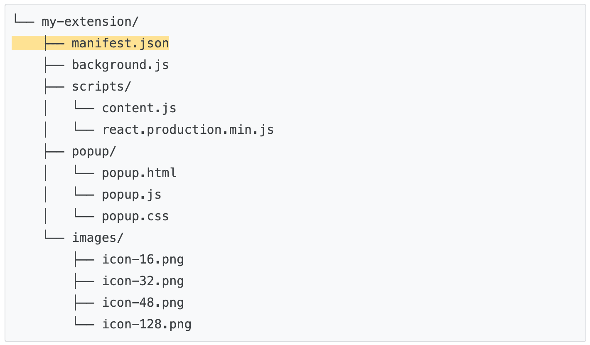
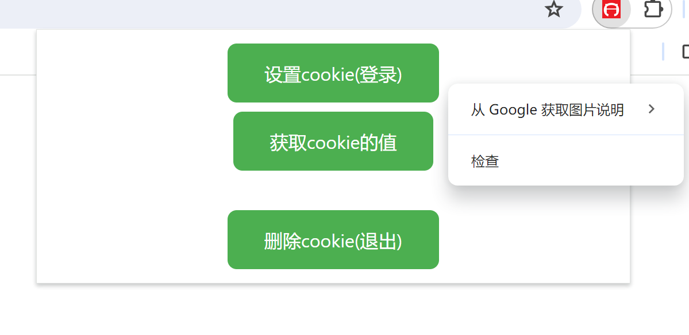
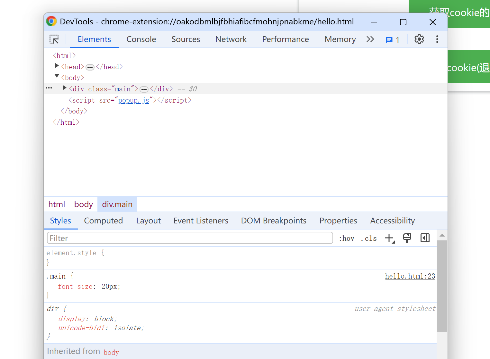

# 案例分析

# chrome插件清单定义

下面我们来分析一下这个扩展，打开刚才的扩展目录`hello`



看到那个`manifest.json` 文件了吗？使用文本编辑器打开它。

```js
{
  // 清单文件版本,以后只支持3了
  "manifest_version": 3,
  // 扩展名称
  "name": "你好",
  // 扩展介绍
  "description": "一个弹出·你好·的扩展",
  // 扩展版本
  "version": "1.0",
  // 扩展行为
  "action": {
    // 默认弹出
    "default_popup": "hello.html",
    // 默认图标
    "default_icon": "images/icon.png"
  },
  // 图标
  "icons": {
    // 扩展程序页面和上下文菜单上的网站图标。
    "16": "images/default.png",
    //     Windows 计算机通常需要此大小。
    "32": "images/default.png",
    //    显示在“扩展程序”页面上。
    "48": "images/default.png",
    // 安装时会显示在 Chrome 应用商店中。
    "128": "images/default.png"
  }
}
```

如上所示，这是一个json清单文件，这个文件就是chrome扩展的核心清单文件，非常重要。
这里面除了`manifest_version`这个属性不能乱改，现在应该都是3，以后说不定有4，5，6，其它的你都能改。
这里面，有几个属性是必需的，分别 `manifest_version`、`name` 和 `version`,这三个属性不能没有。

你可以试着更改其中的`name`名称，又或者把里面图标的路径改成你想要的图标(图片你得自己放进images目录)。

点击刷新|或者重载按钮，就可以看到效果了。



这里要注意：

> 图标最好使用png格式，其它格式也能用，但不能用svg。

`action`里面的默认图标属性`default_icon`是出现在在浏览器右上角的图标，可以省略不写，会使用`icons`里面的图标。
而`icons`属性里的图标是扩展列表和商店上展示的图标。
如果要将自己制作的插件上传到商店，`manifest.json`文件里，不能出现 //xxx 的注释。

# chrome插件的目录规范

没有规矩，不成方圆，首先我们来认识一下一个基本的chrome的目录结构



- mainfest.json chrome扩展的核心清单文件，文件名不可更改并且唯一
- background.js 背景文件
- popup 弹出框文件夹，就是你点击扩展之后会弹出的页面
- scripts 扩展依赖js文件夹
- images 图标以及其它图片存放的地方

> 需要注意的一点是除了mainfest，其它的都是可选项，这是规范，不是规矩，你完全可以自由命名。

# 如何调试chrome插件

在开发过程中，总是免不了出错，调试代码，chrome扩展开发，其实也给我们提供了调试工具。

总体上，调试总体分为

- default_popup(弹出展示)页的调试
- background(背景页)的调试
- content_scripts(内容页)的调试
  
  

调试工具其实就是chrome自带的工具终端（f12），让我们可以看到css，html，js，请求，资源等等一切的输出。


## default_popup弹出展示页的调试



左键点击扩展图标，弹出页面，在页面空白处右键，可以看到出现检查的菜单，点击就会弹出调试窗口。



如图所示，你就能对弹出页进行调试，看是否出错，调试样式，查看请求等等一系列操作。


